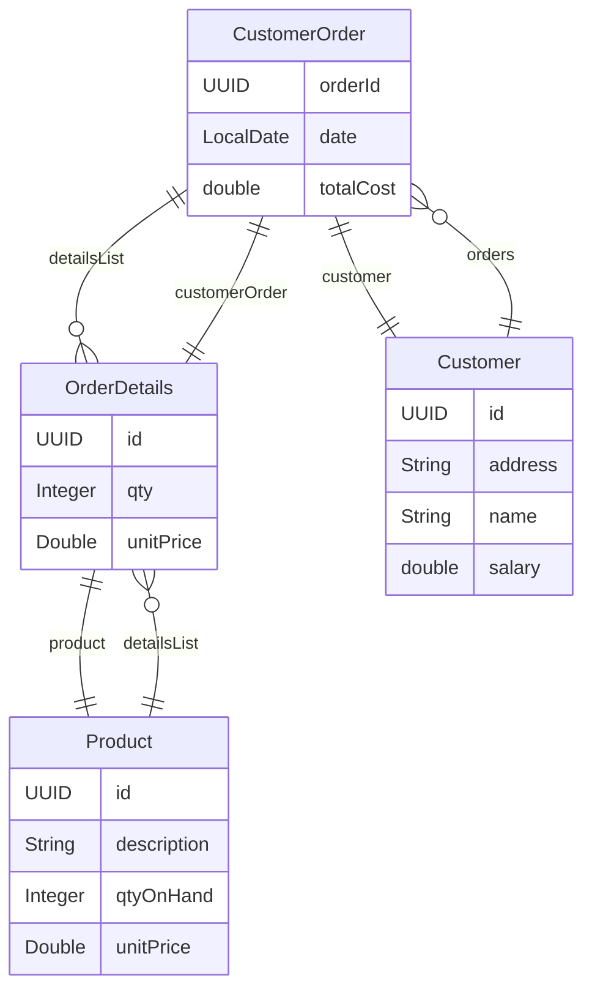

```mermaid
erDiagram
    CustomerOrder {
        UUID orderId
        LocalDate date
        double totalCost
    }

    OrderDetails {
        UUID id
        Integer qty
        Double unitPrice
    }

    Product {
        UUID id
        String description
        Integer qtyOnHand
        Double unitPrice
    }

    Customer {
        UUID id
        String address
        String name
        double salary
    }

    CustomerOrder ||--|| Customer : "customer"
    CustomerOrder ||--o{ OrderDetails : "detailsList"

    OrderDetails ||--|| CustomerOrder : "customerOrder"
    OrderDetails ||--|| Product : "product"

    Product ||--o{ OrderDetails : "detailsList"

    Customer ||--o{ CustomerOrder : "orders"

```
